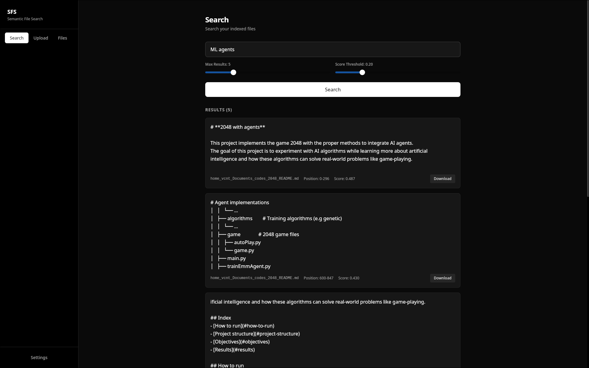

# Semantic File Search Desktop UI (sfs-desktop-ui)


Desktop UI for semantic file search using Tauri + React.

Check [sfs-api](https://github.com/ThiagoAVicente/sfs-api)



## Install

```bash
./install.sh # this will build the app and install it as a standalone binary and application
```

Installs to `~/.local/bin` and creates desktop entry.

## Dependencies

**Build:**
- Node.js 18+
- Cargo (Rust)
- WebKitGTK
